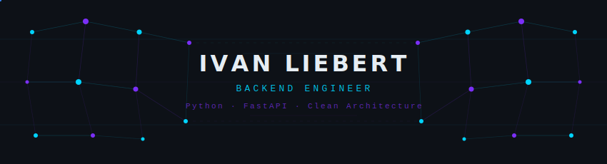

  

    

  

 

### `> whoami`

Backend engineer with production experience in building API-driven and real-time systems.
Architecture-first approach — Clean Architecture, DDD, event-driven patterns.
Every line of code I write is built to last.

<code>> cat expertise.log</code>

 

- Backend architecture and clean separation of concerns
- Async REST and WebSocket APIs (FastAPI, Django)
- Database design and transaction management (PostgreSQL, MySQL, Redis)
- Integration with external APIs — payments, AI, messaging platforms
- Web automation and scraping (Playwright, Selenium, BeautifulSoup)
- Telegram bots and async messaging (Aiogram)
- Containerization and CI/CD pipelines (Docker)
- Linux server configuration, VPN/proxy setup

---

### `> stack`

  

---

### `> git log --stat`

  
  

 

  

---

### `> ls projects/`

#### [`Atlas AI`](https://atlas-ai.ru/) — Production AI Service

> FastAPI backend · payment system · multi-model support (ChatGPT family) · file processing · user dashboard

 

  
  
  
  

---

### `> contrib --animate`

  <picture>
    <source media="(prefers-color-scheme: dark)" srcset="https://raw.githubusercontent.com/akiraliebert/akiraliebert/output/github-snake-dark.svg" />
    <source media="(prefers-color-scheme: light)" srcset="https://raw.githubusercontent.com/akiraliebert/akiraliebert/output/github-snake.svg" />
    
  </picture>

 

